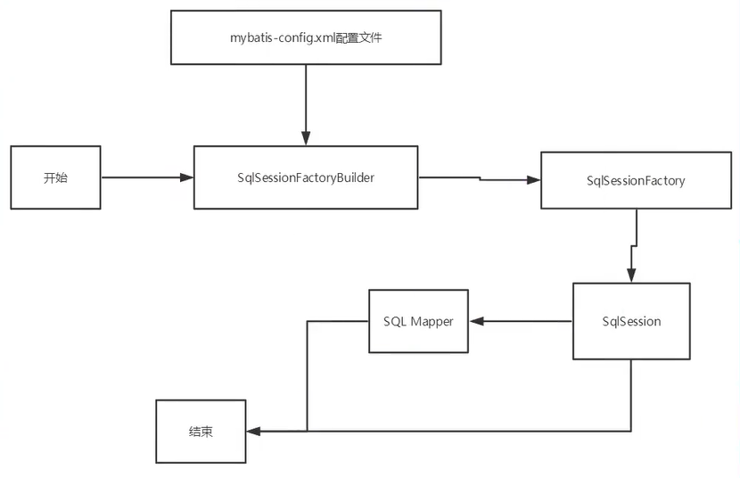
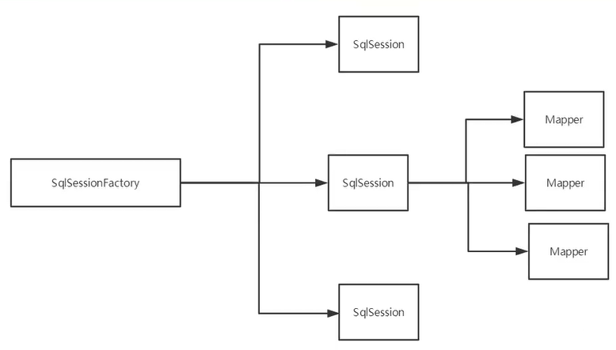
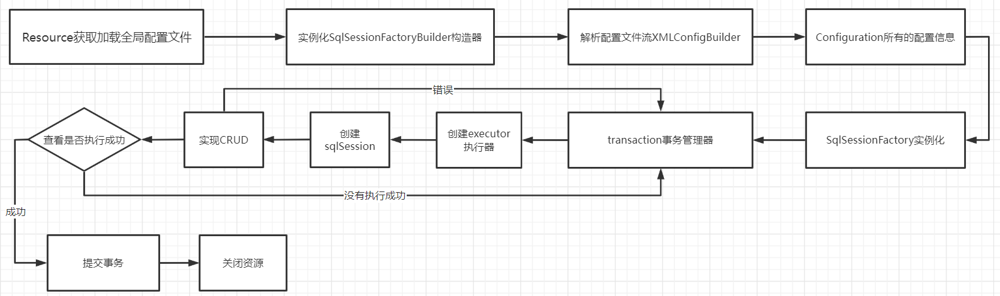
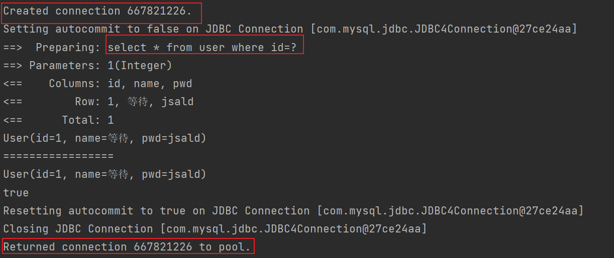
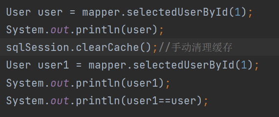
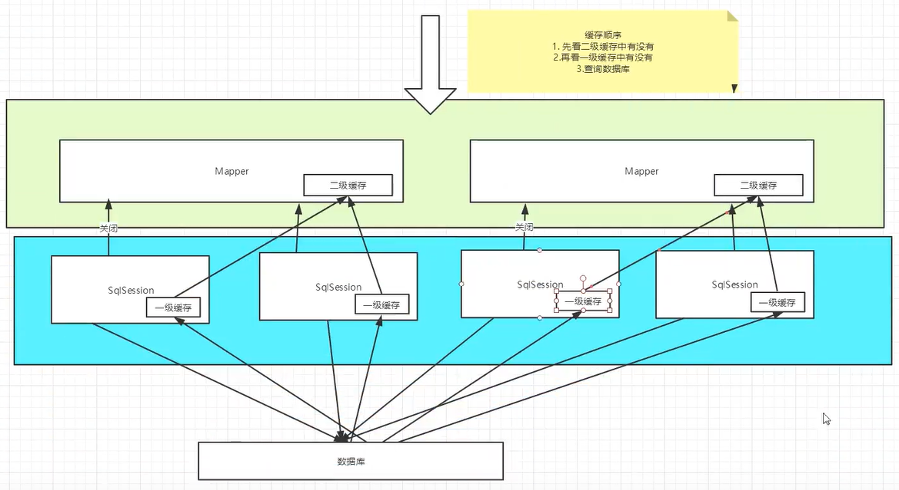

# 一、MyBatis简介


MyBatis 是一款优秀的**持久层框架**；它支持自定义 SQL、存储过程以及高级映射。
**MyBatis 免除了几乎所有的 JDBC 代码以及设置参数和获取结果集的工作。**
MyBatis 可以通过简单的 XML 或注解来配置和映射原始类型、接口和 Java POJO为数据库中的记录。

如何使用MyBatis:
1.maven仓库导入依赖；
2.GitHub：https://github.com/mybatis/mybatis-3/tags

**持久化**：
数据持久化就是将程序的数据在持久状态和瞬时状态转化的过程；

**持久层**：
完成持久化工作；

MyBatis的优点：
简单易学；灵活；sql和代码分离，提高了可维护性；提供对象映射标签，支持对象与数据库的orm字段关系映射；
提供对象关系映射标签，支持对象关系组建维护；提供xml标签，支持编写动态sql。

# 二、第一个MyBatis程序

开发步骤：

1、创建普通的maven项目；
2、导入依赖(主要依赖以下)：

```xml
<dependencies>
    <dependency>
        <groupId>mysql</groupId>
        <artifactId>mysql-connector-java</artifactId>
        <version>5.1.47</version>
    </dependency>
    <dependency>
        <groupId>org.mybatis</groupId>
        <artifactId>mybatis</artifactId>
        <version>3.5.6</version>
    </dependency>
    <dependency>
        <groupId>junit</groupId>
        <artifactId>junit</artifactId>
        <version>4.12</version>
        <scope>test</scope>
    </dependency>
</dependencies>
```

3、创建mybatis的核心配置文件mybatis-config.xml

```xml
<?xml version="1.0" encoding="UTF-8" ?>
<!DOCTYPE configuration
        PUBLIC "-//mybatis.org//DTD Config 3.0//EN"
        "http://mybatis.org/dtd/mybatis-3-config.dtd">
<configuration>
    <environments default="development">
        <environment id="development">
            <transactionManager type="JDBC"/>
            <dataSource type="POOLED">
                <property name="driver" value="com.mysql.jdbc.Driver"/>
                <property name="url" value="jdbc:mysql://localhost:3306/mybatis?			                    useUnicode=true&amp;characterEncoding=UTF-8"/>
                <property name="username" value="root"/>
                <property name="password" value="107610"/>
            </dataSource>
        </environment>
    </environments>
</configuration>
```

4、编写Mybatis工具类：

```java
public class MybatisUtils {
    private static InputStream inputStream = null;
    private static SqlSessionFactory sqlSessionFactory = null;

    static {
        try {
            String resource = "mybatis-config.xml";
            //获取sqlSessionFactory
            inputStream = Resources.getResourceAsStream(resource);
            sqlSessionFactory = new SqlSessionFactoryBuilder().build(inputStream);
        } catch (IOException e) {
            e.printStackTrace();
        }
    }
    /**sqlSession完全包含了面向数据库执行SQL的命令所需要的方法。*/
    public static SqlSession getSqlSession(){
        return sqlSessionFactory.openSession();
    }
}
```

5、开始编码

# 三、mybatis的CRUD

## namespace

namespace：命名空间，要对应操作的mapper接口包名；

```xml
<mapper namespace="com.fivan.mapper.UserMapper">
    <select id="queryUsers" resultType="com.fivan.pojo.User">
        select * from mybatis.user
    </select>
</mapper>
```

## select

```xml
<!--id为namespace对应接口中的方法名，resultType为返回类型-->
<select id="queryUsers" resultType="com.fivan.pojo.User">
    select * from mybatis.user
</select>
```

```xml
<!--通过id查询对应的用户,parameterType为参数类型-->
<select id="queryUserById" parameterType="int" resultType="com.fivan.pojo.User">
    select * from mybatis.user where id = #{id}
</select>
```

## insert

```xml
<!--新增-->
<insert id="insertUser" parameterType="com.fivan.pojo.User">
    insert into mybatis.user(id,name,pwd) values (0,#{name},#{pwd})
</insert>
注：在执行新增操作后一定要加sqlSession.commit();来提交事务，否则不生效
```

## update

```xml
<!--修改-->
<update id="updateUser" parameterType="com.fivan.pojo.User">
    update mybatis.user set name=#{name} where id=#{id}
</update>
注：在执行新增操作后一定要加sqlSession.commit();来提交事务，否则不生效
```

## delete

```xml
<!--删除-->
<delete id="deleteUser" parameterType="int">
    delete from mybatis.user where id = #{id}
</delete>
注：在执行删除操作后一定要加sqlSession.commit();来提交事务，否则不生效
```

# 四、Map和模糊查询

**Map**：当需要操作的字段较多时，可以使用Map来开发；

```java
int insertUsers2(Map<String, String> map);
```

```xml
<insert id="insertUsers2" parameterType="map">
    insert into mybatis.newUser(id,name,pwd) values(0,#{username},#{password})
</insert>
```

```java
SqlSession sqlSession = new MyBatisUtils().getSqlSession();
UserMapper mapper = sqlSession.getMapper(UserMapper.class);
Map<String, String> map = new HashMap<>();
map.put("username","宿舍");
map.put("password","123456qq");
mapper.insertUsers2(map);
sqlSession.commit();
sqlSession.close();
```

**模糊查询**：

```xml
<!--模糊查询-->
<select id="queryLike" resultType="com.fivan.pojo.User" parameterType="map">
    select * from newUser where `name` like #{name};
</select>
注：在Java代码传参时要加通配符%
map.put("name","%等%");
List<User> users = mapper.queryLike(map);
```

# 五、配置属性优化

mybatis-config.xml；MyBatis 的配置文件包含了会深深影响 MyBatis 行为的设置和属性信息。

```
properties（属性）
settings（设置）
typeAliases（类型别名）
typeHandlers（类型处理器）
objectFactory（对象工厂）
plugins（插件）
environments（环境配置）
	environment（环境变量）
		transactionManager（事务管理器）
		dataSource（数据源）
databaseIdProvider（数据库厂商标识）
mappers（映射器）
```

## environments（环境配置）

MyBatis在配置文件中可以配置成适应多种环境；
**尽管可以配置多个环境，但每个SQLSessionFactory实例只能选择一种环境。**
MyBatis默认的事务管理器为JDBC，连接池：POOLED

## properties（属性）

可以通过properties属性来实现引用配置文件；
这些属性可以在外部进行配置，并可以进行动态替换。既可以在典型的 Java 属性文件中配置这些属性，也可以在 properties 元素的子元素中设置。

编写完properties后，再配置文件中加入以下代码即可：

```properties
<properties resource="db.properties"/>
或
<properties resource="db.properties">
    <property name="username" value="root"/>
    <property name="password" value="107610"/>
</properties>
```

注：可以在外部properties资源中直接引用；也可再重新加入属性；如果两处都有相同的字段，则会优先使用外部的。

# 六、配置别名优化

## typeAliases（类型别名）

类型别名可为 Java 类型设置一个缩写名字。 它仅用于 XML 配置，意在降低冗余的全限定类名书写。

```xml
<typeAliases>
    <!--以下两行设置其中的一行即可-->
    <typeAlias type="com.fivan.pojo.User" alias="User"/>
</typeAliases>
```

通过这种方式设置，则mapper.xml中的返回值类型可用alias值作为类型即可

```xml
<select id="selectUser" resultType="User">
    select * from newUser
</select>
```

指定一个包名，MyBatis 会在包名下面搜索需要的 Java Bean（包扫描）

```xml
<typeAliases>
    <package name="com.fivan.pojo"/>
</typeAliases>
```

扫描实体类的包，它的默认别名就是该类的类名小写

```xml
<select id="selectUser" resultType="user">
    select * from newUser
</select>
```

**适用场景**：在实体类较少的情况下，使用第一种；反之，用第二种；
区别：第一种可以自定义别名；而第二种默认是类名小写；如要修改，可以在需要修改的类上加注解

```java
@Alias("自定义名")
public class User{}
```

## settings（设置）

```xml
<settings>
  <setting name="cacheEnabled" value="true"/><!--是否开启缓存-->
  <setting name="lazyLoadingEnabled" value="true"/><!--是否懒加载-->
  <setting name="useGeneratedKeys" value="false"/><!--是否自动生成主键-->
  <setting name="mapUnderscoreToCamelCase" value="false"/><!--是否驼峰命名映射-->
  <setting name="logImpl" value=""/>
</settings>
```

**MyBatis plugins插件**：mybatis-generator-core；mybatis-plus；通用mapper

# 七、配置映射器

### 映射器（mappers）

通过映射器绑定Mapper.xml文件

方式一：resource

```xml
<mappers>
    <mapper resource="com/fivan/mapper/UserMapper.xml"/>
</mappers>
```

方式二：class

```xml
<mappers>
    <mapper class="com.fivan.mapper.UserMapper"/>
</mappers>
```

**注**：使用class绑定时，mapper.xml的文件名和接口名要保持一致；且在同一个包下。

方式三：package

```xml
<mappers>
    <package name="com.fivan.mapper"/>
</mappers>
```

**注**：使用package绑定时，mapper.xml的文件名和接口名要保持一致；且在同一个包下。

# 八、生命周期、作用域

作用域和生命周期类别是至关重要的，因为错误的使用会导致非常严重的并发问题。



**SqlSessionFactoryBuilder**
一旦创建SqlSessionFactory之后就不再需要了；作用域适合放在**局部变量**；

**SqlSessionFactory**
好比是数据库连接池；
SqlSessionFactory 一旦被创建就应该在应用的运行期间一直存在，**没有任何理由丢弃它或重新创建另一个实例**。
最佳作用域是应用作用域；最简单的就是使用**单例模式**或者**静态单例模式**。

**SqlSession**
好比连接池的一个请求；
SqlSession 的实例不是线程安全的，因此是不能被共享的，所以它的最佳的作用域是**请求或方法**作用域。
用完需要关闭，否则会占用资源；



mapper代表每个执行的业务。

# 九、ResultMap:结果集映射

resultMap元素是 MyBatis 中最重要最强大的元素。
ResultMap 的设计思想是，对简单的语句做到零配置，对于复杂一点的语句，只需要描述语句之间的关系就行了。

```xml
<!--type为对应的实体类-->
<resultMap id="UserMap" type="User">
    <!--column为数据库中的字段名，property为实体类的字段-->
    <result column="id" property="id"/>
    <result column="name" property="name"/>
    <result column="pwd" property="password"/>
</resultMap>
<select id="selectUserById"  resultMap="UserMap">
    select * from newUser where `id` = #{id}
</select>
```

# 十、日志工厂

数据库操作出错时，排错最好的就是日志工厂；

**logImpl**：指定 MyBatis 所用日志的具体实现，未指定时将自动查找。
SLF4J；**LOG4J**(deprecated since 3.5.9) ；LOG4J2 ；JDK_LOGGING；COMMONS_LOGGING；**STDOUT_LOGGING**；NO_LOGGING

```xml
<settings>
    <!--STDOUT_LOGGING为标准实现-->
    <setting name="logImpl" value="STDOUT_LOGGING"/>
</settings>
```

# 十一、Log4j

通过使用Log4j，我们可以控制日志信息输送的目的地是控制台、文件、GUI组件等；
也可以控制每一条日志的输出格式；通过定义每一条日志信息的级别，能够更加细致地控制日志的生成过程。
最令人感兴趣的就是，这些可以通过一个配置文件来灵活地进行配置，而不需要修改应用的代码。

使用时
1、要先导包：maven即可
2、创建log4j.properties配置文件,参考内容：

```properties
#将等级为DEBUG的日志信息输出到console和file这两个目的地，console和file的定义在下面的代码
log4j.rootLogger=DEBUG,console,file
#控制台输出的相关设置
log4j.appender.console = org.apache.log4j.ConsoleAppender
log4j.appender.console.Target = System.out
log4j.appender.console.Threshold=DEBUG
log4j.appender.console.layout = org.apache.log4j.PatternLayout
log4j.appender.console.layout.ConversionPattern=[%c]-%m%n
#文件输出的相关设置
log4j.appender.file = org.apache.log4j.RollingFileAppender
log4j.appender.file.File=./log/fivan.log
log4j.appender.file.MaxFileSize=10mb
log4j.appender.file.Threshold=DEBUG
log4j.appender.file.layout=org.apache.log4j.PatternLayout
log4j.appender.file.layout.ConversionPattern=[%p][%d{yy-MM-dd}][%c]%m%n
#日志输出级别
log4j.logger.org.mybatis=DEBUG
log4j.logger.java.sql=DEBUG
log4j.logger.java.sql.Statement=DEBUG
log4j.logger.java.sql.ResultSet=DEBUG
log4j.logger.java.sql.PreparedStatement=DEBUG
```

3、在mybatis配置文件中设置实现为log4j；

```xml
<settings>
    <setting name="logImpl" value="LOG4J"/>
</settings>
```

**使用**
1、导入：import org.apache.log4j.Logger;
2、实例对象

```java
Logger logger = Logger.getLogger(MyBatisTest.class);
logger.info("info:testLog4j");
logger.debug("debug:testLog4j");
logger.error("error:testLog4j");
```

# 十二、Limit分页

```xml
<select id="selectUsersByLimit" parameterType="map" resultMap="UserMap">
    select * from newUser limit #{startIndex},#{pageSize};
</select>
```

# 十三、RowBounds分页

```java
SqlSession sqlSession = MyBatisUtils.getSqlSession();
RowBounds bounds = new RowBounds(0,2);
//使用rowBounds分页，直接用sqlSession调用selectList,第一个参数为接口中对应的方法
List<User> userList = sqlSession.selectList(
        "com.fivan.mapper.UserMapper.selectUserByRowBounds",null,bounds);
```

# 十四、使用注解开发

**面向接口编程**
之前学过面向对象编程，也学习过接口，但在真正的开发中，很多时候我们会选择面向接口编程
**根本原因：解耦，可拓展，提高复用，分层开发中，上层不用管具体的实现，大家都遵守共同的标准，使得开发变得容易，规范性更好**

**关于接口的理解**
接口从更深层次的理解，应是定义(规范，约束)与实现(名实分离的原则)的分离。
接口的本身反映了系统设计人员对系统的抽象理解。
接口应有两类: 
第一类是对一个个体的抽象，它可对应为一一个抽象体(abstract class);
第二类是对一个个体某- 方面的抽象，即形成一个抽象面(interface) ;
一个体有可能有多个抽象面。抽象体与抽象面是有区别的。

**三个面向区别**
面向对象是指，我们考虑问题时，以对象为单位，考虑它的属性及方法.
面向过程是指，我们考虑问题时，以个具体的流程(事务过程)为单位，考虑它的实现.
接口设计与非接口设计是针对复用技术而言的，与面向对象(过程)不是一 个问题.更多的体现就是对系统整体的架构

**使用注解开发**

本质：通过反射机制的实现

底层：动态代理

```java
@Select("select * from newUser")
List<User> getUsers();//查
@Insert("insert into newUser values(0,#{name},#{pwd})")
int insertUser(User user);//增
@Delete("delete from newUser where `id`=#{id}")
int deleteUser(@Param("id")int id);//删
@Update("update newUser set `name`=#{name} where `id`=#{id}")
int updateUser(User user);//改
```

```xml
<mappers>
    <mapper class="com.fivan.mapper.UserMapper"/>
</mappers>
```

**@Param("id")**

在基本类型的参数或String类型上需要加此注解；引用类型不需要加；在SQL中引用的为此注解中定义的属性名。

# 十五、mybatis执行流程



# 十六、Lombok

Lombok是一个Java库；可以自动插入编辑器和构建工具；通过在类上加注解的方式，可以省去编写get/set、构造器等；

使用时现在idea中下载Lombok的插件；再加入maven库的jar包

```java
//常见的注解
@Data：无参、get/set、tostring、hashcode。。。
@AllArgsConstructor：有参构造
@NoArgsConstructor：无参构造
```

# 十七、多对一的处理

多个学生对应一个老师；
对于学生而言，**关联** 多个学生关联一个老师【多对一】

复杂的属性要单独处理，对象用association；集合用collection

```xml
<!--方式一-->
<select id="selectStudents" resultMap="StudentTeacher">
    select * from student
</select>
<resultMap id="StudentTeacher" type="Student">
    <association property="teacher" column="tid" javaType="Teacher" select="selectTeacher"/>
</resultMap>
<select id="selectTeacher" resultType="Teacher">
    select * from teacher where id=#{tid}
</select>
```

```xml
<!--方式二-->
<select id="selectStudents2" resultMap="StudentTeacher2">
    select s.id sid,s.name sname,t.name tname from student s inner join teacher t on s.tid = t.id
</select>
<resultMap id="StudentTeacher2" type="Student">
    <result property="id" column="sid"/>
    <result property="name" column="sname"/>
    <association property="teacher" javaType="Teacher">
        <result property="name" column="tname"/>
    </association>
</resultMap>
```


# 十八、一对多的处理

多个学生对应一个老师；
对于老师而言，**集合** 一个老师有很多个学生【一对多】

复杂的属性要单独处理，对象用association；集合用collection

```xml
<!--方式一-->
<select id="selectTeachers2" resultMap="TeacherStudent2">
    select * from teacher where id = #{tid}
</select>
<resultMap id="TeacherStudent2" type="Teacher">
    <collection property="studentList" javaType="ArrayList"  ofType="Student" select="selectStudent" column="id"/>
</resultMap>
<select id="selectStudent" resultType="Student">
    select * from student where tid = #{id}
</select>
```

```xml
<!--方式二-->
<select id="selectTeachers" resultMap="TeacherStudent">
    select s.id sid,s.name sname,t.name tname,t.id tid
    from teacher t inner join student s on t.id = s.tid
</select>
<resultMap id="TeacherStudent" type="Teacher">
    <result property="id" column="tid"/>
    <result property="name" column="tname"/>
    <collection property="studentList"  ofType="Student">
        <result property="id" column="sid"/>
        <result property="name" column="sname"/>
        <result property="tid" column="tid"/>
    </collection>
</resultMap>
```

# 十九、动态SQL

动态SQL是指根据不同的业务生成不同的SQL语句；

- if
- choose (when, otherwise)
- trim (where, set)
- foreach

# 二十、动态SQL常用标签

## if语句

```xml
<select id="selectBlogs" parameterType="map" resultType="Blog">
    select * from blog where 1=1
    <if test="title != null">
        and `title` like #{title}
    </if>
    <if test="author != null">
        and author=#{author}
    </if>
</select>
```

注：在Java代码传参时要加通配符%

```java
map.put("title","%Java%");
```

## where语句

*where* 元素只会在子元素返回任何内容的情况下才插入 “WHERE” 子句。而且，若子句的开头为 “AND” 或 “OR”，*where* 元素也会将它们去除。

```xml
<select id="selectBlogs2" parameterType="map" resultType="Blog">
    select * from blog
    <where>
        <if test="title != null">
            `title` like #{title}
        </if>
        <if test="author != null">
            and author=#{author}
        </if>
    </where>
</select>
```

## choose语句

choose元素会像Java中的switch语句一样，从上往下进行条件的匹配，前面的条件匹配到就不会往下继续匹配；即便所有条件满足也不会。

```xml
<select id="selectBlogs3" parameterType="map" resultType="Blog">
    select * from blog
    <where>
        <choose>
            <when test="title != null">
                `title` like #{title}
            </when>
            <when test="author != null">
                and author=#{author}
            </when>
            <otherwise>
                and views=#{views}
            </otherwise>
        </choose>
    </where>
</select>
```

## set语句

*set* 元素会动态地在行首插入 SET 关键字，并会删掉额外的逗号

```xml
<update id="updateBlog" parameterType="map">
    update blog
    <set>
        <if test="title != null">
            `title`=#{title},
        </if>
        <if test="author != null">
            and author=#{author}
        </if>
    </set>
    where id=#{id}
</update>
```

## SQL片段

将一些功能查询模块抽离出来，写成SQL片段；
用sql标签编写公共部分；在需要引用的地方使用Include标签引用即可。

```xml
<select id="selectBlogs2" parameterType="map" resultType="Blog">
    select * from blog
    <where>
        <include refid="sqlSelect"></include>
    </where>
</select>
<sql id="sqlSelect">
    <if test="title != null">
        `title` like #{title}
    </if>
    <if test="author != null">
        and author=#{author}
    </if>
</sql>
```

## foreach语句

将要遍历的集合赋给collection

```xml
<select id="selectBlogs" parameterType="map" resultType="Blog">
    select * from blog
    <where>
        <foreach collection="ids" item="id" open="and id in (" separator="," close=")">
            #{id}
        </foreach>
    </where>
</select>
```

动态SQL实则就是在拼接SQL语句，只要保证SQL的准确性，按照SQL的格式排列组合即可。

# 二十一、缓存Cache 

存在内存中的临时数据。
将用户经常查询的数据放在缓存(内存)中，用户去查询数据就不用从磁盘上(关系型数据库数据文件)查询，
从缓存中查询,从而提高查询效率,解决了高并发系统的性能问题。
优点：减少和数据库的交互次数,减少系统开销，提高系统效率。
什么样的数据能使用缓存?经常查询并且不经常改变的数据。

MyBatis包含一个非常强大的查询缓存特性, 它可以非常方便地定制和配置缓存。缓存可以极大的提升查询效率。

MyBatis系统中默认定义了两级缓存:一级缓存和二级缓存
默认情况下，只有一级缓存开启。 (SqlSession级别的缓存, 也称为本地缓存)
二级缓存需要手动开启和配置，他是基于namespace级别的缓存。
为了提高扩展性，MyBatis定义了缓存接口Cache。我们可以通过实现Cache接口来自定义二级缓存。

## 一级缓存

一级缓存也叫本地缓存；
与数据库同一次会话期间查询到的数据会放在本地缓存中。
以后如果需要获取相同的数据，直接从缓存中拿,没必须再去查询数据库;





缓存失效的情况：查询不同的数据；增删改和改变数据的操作都会刷新缓存；查询不同的mapper.xml；手动清理缓存

总结：一级缓存是默认开启的，只在一次sqlSession中有效，即拿到连接到关闭连接。

## 二级缓存

二级缓存也叫全局缓存，一级缓存作用域太低了，所以诞生了二级缓存
基于namespace级别的缓存；一个名称空间，对应一个二级缓存;
工作机制
一个会话查询一条数据，这个数据就会被放在当前会话的一级缓存中; 
当前会话关闭了，这个会话对应的一级缓存就没了；一级缓存中的数据被保存到二级缓存中;
新的会话查询信息，就可以从二级缓存中获取内容;
不同的mapper查出的数据会放在自己对应的缓存(map)中;

使用时先在配置文件中开启缓存：

```xml
<!--开启全局缓存-->
<setting name="cacheEnabled" value="true"/>
```

在要使用二级缓存的mapper.xml中配置中开启

```xml
<!--开启缓存-->
<cache/>
<!--也可自定义参数-->
<cache
       eviction="FIFO"
       flushInterval="60000"
       size="512"
       readOnly="true"/>
```

使用不带参数的cache时，需要将实体类实现序列化！

```java
public class User implements Serializable {}
```

只要开启了二级缓存，在同一个mapper下就有效；所有得数据都会先放在缓存中，当此会话提交或关闭时，才会被提交到二级缓存中。

## mybatis缓存原理



## 自定义缓存-Ehcache
